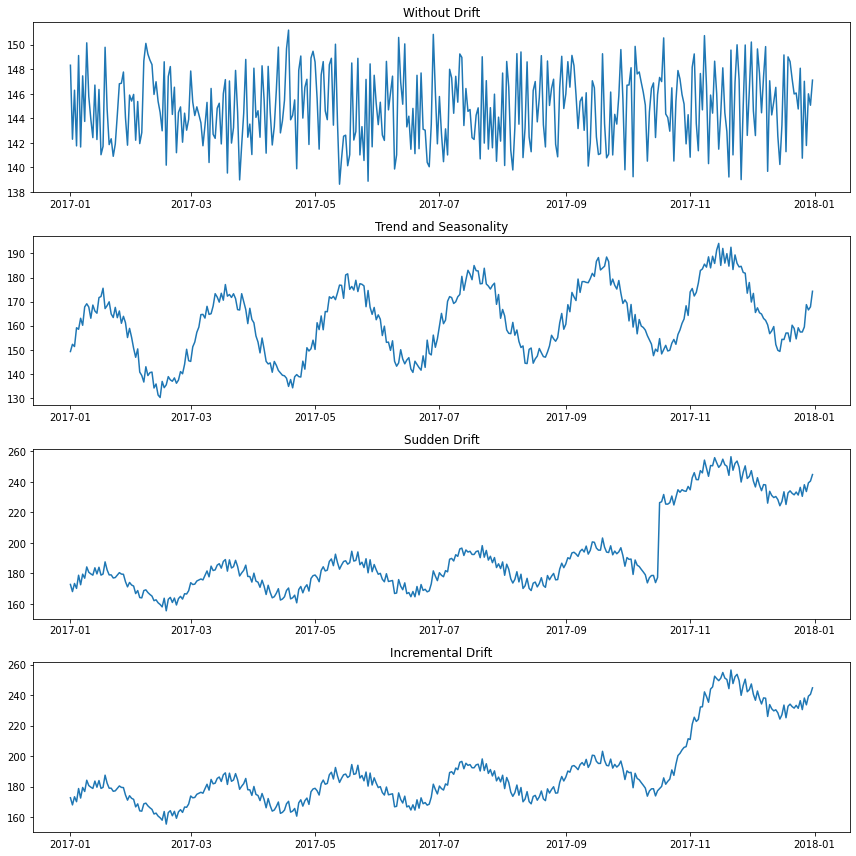

# Master thesis project of Sarah Beshr, Nina D'Hondt and Chidi Nweke.

## Goals
The goal of the project was to investigate the impact of  concept drift on the predictive performance in time series forecasting. 

## Contributions

    1.During this project a method to generate synthethic time series was developed. We refer you to the TimeSeriesGenerator.py file for more information.

    2. Aside from this, the project also developed a way to benchmark the performance of machine learning models under different conditions of drift. These are defined in the conditions.py file. The evaluation is doe in the parallelExperiment.py file.

## Tutorials

We recommend interested readers to look at the FirstExperiment notebook followed by the automedExperiment notebook to get a small tutorial on how to use the code. Interested readers can also reach out to the authors for more information and/or to get a copy of the full thesis.

 ## How can I use the existing code?

We expect any interested party to be able to do the following with minimal adaptations:

    1. Use the code to generate synthetic time series.
    2. Use different models than the ones discussed in the thesis on the same set of conditions.
    3. Generate different conditions with the same set of models.

Other extensions are possible but might require more work in the code. Specifically the series_grouper.py file is a good starting point to extend the code by adding new features to the Experiment class. Feel free to contact the authors, specifically Chidi Nweke, for information on how to extend the code.